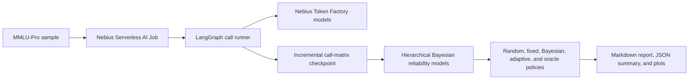

# Bayesian Orchestrator

Cost-aware Bayesian model routing evaluated as a reproducible Nebius Serverless AI Job.

This project asks a practical orchestration question: **when should an AI system use a cheap model, a stronger model, or pay for a second opinion?** It builds a complete model-question call matrix on MMLU-Pro through Nebius Token Factory, fits hierarchical Bayesian reliability models, and compares adaptive routing with random, fixed-model, single-shot Bayesian, and oracle policies.

Built for the **Nebius Serverless AI Builders Challenge** in the AI & ML / evaluation and agentic workflow category.

## Why Serverless AI

The workload is a finite, restartable batch evaluation rather than an interactive service, so it runs as a Nebius Serverless AI Job. The container:

1. Loads a deterministic MMLU-Pro sample.
2. Calls each configured Token Factory model for every question.
3. Appends every completed call to a durable checkpoint.
4. Fits pre-call and post-call Bayesian reliability models.
5. Evaluates routing policies and writes reports, metrics, and plots.

Nebius Serverless AI provides disposable compute for the evaluation job, while Nebius Token Factory provides the OpenAI-compatible model API. A shared filesystem preserves checkpoints and results when a job exits or restarts.

## Architecture



## Methodology

The router estimates each model's posterior probability of answering correctly, conditioned on model identity, subject, question length, and observed call features. It then selects the action with the highest posterior expected utility:

$$
\mathbb{E}[u\mid D,q,m]
=
\Pr(y_{q,m}=1\mid D)-\lambda c_{q,m}.
$$

The adaptive policy can request a second model when its expected correction gain exceeds its token cost and a configurable minimum margin. When models disagree, their answers are adjudicated using posterior reliability. This is a cost-sensitive, myopic value-of-information policy, not full Bayesian experimental design.

The full model specification, policy equations, diagnostics, assumptions, and claim boundaries are documented in [`MATH_APPROACH.md`](MATH_APPROACH.md).

## Quick Start

Requirements:

- Python 3.10 or newer
- [`uv`](https://docs.astral.sh/uv/)
- Docker, only for the container workflow
- A Nebius Token Factory API key, only for live runs

Install and test:

```bash
UV_CACHE_DIR=.uv-cache uv sync --frozen
UV_CACHE_DIR=.uv-cache uv run python -m unittest discover -s tests -v
```

Run the deterministic, network-free smoke test:

```bash
UV_CACHE_DIR=.uv-cache uv run bayesian-orchestrator run \
  --config examples/mmlu-bayesian-orchestrator/config.yaml
```

The smoke test uses synthetic questions and deterministic fake responses. It validates the workflow but is not evidence of routing lift.

## Live Benchmark

The canonical challenge configuration is [`examples/mmlu-bayesian-orchestrator/mmlu-pro-final.yaml`](examples/mmlu-bayesian-orchestrator/mmlu-pro-final.yaml). It uses:

- MMLU-Pro test split
- 4,000 stratified questions
- Three Token Factory models
- A 30% exploration / 70% held-out split, stratified by category
- 500 NUTS warmup steps and 1,000 posterior samples
- 5,000 bootstrap iterations
- At most two calls per deployed adaptive decision

Set the API key and run:

```bash
export NEBIUS_API_KEY=<token-factory-api-key>

UV_CACHE_DIR=.uv-cache uv run bayesian-orchestrator run \
  --config examples/mmlu-bayesian-orchestrator/mmlu-pro-final.yaml
```

The config validates selected model IDs and dated pricing entries before making missing calls. Every completed question-model pair is checkpointed. For a less expensive trial, copy the final config and reduce `dataset.sample_count`, `mcmc.warmup`, `mcmc.samples`, and `evaluation.bootstrap_iterations`.

Do not modify the canonical config after publishing benchmark results. Create a new config so each result remains traceable.

### Runtime, Hardware, And Cost

The final call matrix contains $4{,}000\times3=12{,}000$ sequential API calls. Approximate runtime is:

$$
T_{\mathrm{total}}
\approx
\sum_{i\in\mathrm{missing\ calls}}T_i
+T_{\mathrm{Bayesian\ fitting}}
+T_{\mathrm{bootstrap}}.
$$

At an illustrative average of 2-10 seconds per API call, initial collection takes roughly 7-33 hours. A resumed run only makes missing calls.

Model inference happens in Token Factory, so a GPU is not required. Use a regular CPU Serverless AI preset with at least 8 vCPUs and 32 GiB RAM as a conservative starting point for JAX/NumPyro fitting.

Token spend depends on prompt and completion lengths. With the checked-in June 14, 2026 price snapshot and an illustrative average of 300 input plus 100 output tokens per call, the full matrix costs about **$0.83 in Token Factory inference**. This excludes Serverless AI compute and storage. The generated `summary.json` records actual token counts and model-call costs.

### Other OpenAI-Compatible Providers

The implementation is not hard-coded to `NEBIUS_API_KEY`. `provider.api_key_env` names the environment variable to read, while `provider.base_url` can point to another OpenAI-compatible API:

```yaml
provider:
  type: openai_compatible
  base_url: https://provider.example/v1/
  api_key_env: OPENAI_COMPATIBLE_API_KEY
  temperature: 0.0
  max_tokens: 1024
  json_mode: true
  validate_models: false
  reuse_cache: true
  cache_file: call_matrix.jsonl
```

```bash
export OPENAI_COMPATIBLE_API_KEY=<provider-api-key>
```

Set `validate_models: false` unless the provider supports the `/v1/models?verbose=true` response shape used by Token Factory. Replace model IDs and provide explicit prices or a compatible pricing catalog before making cost comparisons. The canonical challenge benchmark remains Nebius-specific.

## Docker

Build and test the image locally:

```bash
docker build -t bayesian-orchestrator:latest .
docker run --rm \
  -v "$PWD/outputs:/app/outputs" \
  bayesian-orchestrator:latest \
  run --config examples/mmlu-bayesian-orchestrator/config.yaml
```

Publish it to a registry Nebius can access:

```bash
docker tag bayesian-orchestrator:latest <registry>/<repo>/bayesian-orchestrator:latest
docker push <registry>/<repo>/bayesian-orchestrator:latest
```

For a private registry, use Nebius registry credentials or `--registry-secret`. Never put credentials in this repository.

## Nebius Serverless Job

First run the network-free smoke test in Serverless AI:

```bash
nebius ai job create \
  --name bayesian-routing-smoke \
  --image <registry>/<repo>/bayesian-orchestrator:latest \
  --args "run --config examples/mmlu-bayesian-orchestrator/config.yaml" \
  --timeout 1h \
  --platform <cpu-platform-id> \
  --preset <cpu-preset> \
  --subnet-id <subnet-id> \
  --volume '<filesystem-id>:/app/outputs:rw'
```

Run the final benchmark using a MysteryBox secret and shared filesystem:

```bash
nebius ai job create \
  --name bayesian-routing-mmlu-pro \
  --image <registry>/<repo>/bayesian-orchestrator:latest \
  --args "run --config examples/mmlu-bayesian-orchestrator/mmlu-pro-final.yaml" \
  --env-secret NEBIUS_API_KEY=<mysterybox-secret-selector> \
  --timeout 48h \
  --platform <cpu-platform-id> \
  --preset <8vcpu-32gb-or-larger-preset> \
  --subnet-id <subnet-id> \
  --volume '<filesystem-id>:/app/outputs:rw'
```

Use a timeout longer than the estimated remaining-call duration. Nebius currently permits job timeouts from 1 through 168 hours and defaults to 24 hours.

Mount a shared filesystem at `/app/outputs`. The checkpoint uses append and fsync semantics, so do not use an S3-backed mount for `call_matrix.jsonl`.

Long Token Factory runs should configure application-level retries for transient API failures:

```yaml
provider:
  request_max_attempts: 8
  retry_initial_delay_seconds: 2
  retry_max_delay_seconds: 60
```

The workflow retries connection failures, timeouts, and HTTP `429`, `500`, `502`, `503`, and `504` responses with capped exponential backoff. A result is checkpointed only after a successful response, so exhausted retries can be resumed from the same persistent `call_matrix.jsonl`.

## Monitoring And Resume

```bash
nebius ai job list
nebius ai job logs <job-id> --follow --timestamps
nebius ai job cancel <job-id>
nebius ai job delete <job-id>
```

To resume, create a replacement job with the same config and the same shared filesystem mounted at `/app/outputs`. With `provider.reuse_cache: true`, the workflow validates existing rows and calls only missing question-model pairs.

Use one writer per checkpoint file. Never run two jobs against the same `call_matrix.jsonl`. To intentionally restart from scratch, move the existing output directory aside before creating a new job.

## Result Validation

The final output directory is:

```text
outputs/benchmarks/mmlu-pro-4000-stratified-seed48219/
```

Expected files:

- `call_matrix.jsonl`: append-only model-call checkpoint
- `report.md`: human-readable results and reproducibility metadata
- `summary.json`: machine-readable metrics, token usage, and costs
- `mmlu_reliability.png`: predictive calibration
- `mmlu_policy_utility.png`: policy utility comparison

Check the matrix size and inspect metrics:

```bash
wc -l outputs/benchmarks/mmlu-pro-4000-stratified-seed48219/call_matrix.jsonl

UV_CACHE_DIR=.uv-cache uv run python - <<'PY'
import json
from pathlib import Path

path = Path("outputs/benchmarks/mmlu-pro-4000-stratified-seed48219/summary.json")
data = json.loads(path.read_text(encoding="utf-8"))
print(json.dumps(data["metrics"], indent=2))
PY
```

The final matrix should contain 12,000 unique rows. Before reporting an improvement, verify that:

- no `nan` values appear in `summary.json`;
- exploration and held-out counts match the config;
- random and fixed-model baselines are present;
- bootstrap intervals and robustness gates support the written claim;
- actual token totals, model-call cost, and runtime are reported;
- warnings and dependence-group cautions are included in the article.

Policies evaluated on held-out questions are:

- `random`: exact expected utility from uniform model selection
- `always_<model>`: one fixed-model baseline per configured model
- `single_shot_bayesian`: one call selected by pre-call posterior utility
- `adaptive_bayesian`: optional second call and reliability-based adjudication
- `oracle`: best observed answer, used only as an upper bound

Reports also include Brier score, log score, AUROC, LOO ELPD, bootstrap intervals, token cost, latency, throughput, answer diversity, and dependence-group warnings.

### Publishing Results

Raw outputs are ignored by Git. After reviewing the final artifacts:

1. Create a versioned directory such as `results/mmlu-pro-4000-seed48219/`.
2. Copy `report.md`, `summary.json`, and selected plots.
3. Do not publish `call_matrix.jsonl` until question licensing, raw responses, and accidental sensitive content have been reviewed.
4. Add measured job configuration, runtime, Token Factory cost, and Serverless AI compute cost to the project documentation.
5. Link the technical article and optional video below.

## Reproducibility

- Dataset sampling, train/test splitting, and fake-provider responses are seeded.
- The container installs the locked `uv.lock` environment.
- Live pricing is resolved from a dated catalog in [`pricing/`](pricing/).
- Model IDs are validated before missing Token Factory calls start.
- Every call is flushed and synced before the next call begins.
- Compatible checkpoints skip completed question-model pairs.
- Configs and pricing snapshots should be preserved with published results.

## Security

Never commit API keys, registry credentials, MysteryBox secret values, private datasets, or unreviewed raw outputs. Keep credentials in environment variables locally and use `--env-secret` with MysteryBox for Nebius jobs. If a credential is exposed, revoke it immediately and remove it from Git history before publishing.

Generated call matrices contain benchmark question text, raw model responses, and provider metadata. Review licensing and content before publishing. Prefer sharing aggregate `summary.json`, the generated report, and plots.

## Troubleshooting

Missing Token Factory key:

```bash
export NEBIUS_API_KEY=<token-factory-api-key>
```

Hugging Face rate limits:

```bash
export HF_TOKEN=<hugging-face-token>
```

Structured response failures:

- Keep `provider.json_mode: true`.
- The workflow retries without `response_format` if the provider rejects JSON mode.
- Keep `provider.max_tokens` at least `128`.
- Check model capability metadata before changing the benchmark model set.

Cache incompatibility after changing questions, models, or prompts:

- Use a new `output_dir`, or move the old directory aside.
- Do not edit a completed call matrix by hand.
- Preserve the config and pricing snapshot alongside published results.

## Limitations

- A full call matrix enables exact offline comparison on this sample, but production routing needs randomized exploration, logged propensities, A/B tests, or off-policy estimators.
- Self-reported model confidence is an input feature to audit, not a calibrated posterior.
- Similar models may have correlated errors; `dependence_group` warnings expose but do not fully model this dependence.
- The adaptive policy is myopic and limited to the configured maximum number of calls.
- Conclusions are specific to the sampled questions, models, prompts, prices, and run date.

## Repository Layout

```text
bayesian_orchestrator/                 Python package and workflows
examples/bayesian-orchestrator/       Synthetic Bayesian routing example
examples/mmlu-bayesian-orchestrator/  Smoke, calibration, and final configs
pricing/                              Versioned Token Factory price snapshots
tests/                                Unit tests for pricing and sampling
.github/workflows/                    GitHub Actions CI
Dockerfile                            Reproducible Serverless AI image
MATH_APPROACH.md                      Statistical design and limitations
```

## Challenge Submission

- Challenge tag: `#NebiusServerlessChallenge`
- Technical article: to be added after the final benchmark completes
- Video walkthrough: optional, to be added if published

## License

Released under the [MIT License](LICENSE).

Official references: [Serverless AI overview](https://docs.nebius.com/serverless/overview), [managing Serverless AI jobs](https://docs.nebius.com/serverless/jobs/manage), and [Token Factory API](https://docs.tokenfactory.nebius.com/api-reference/introduction).
