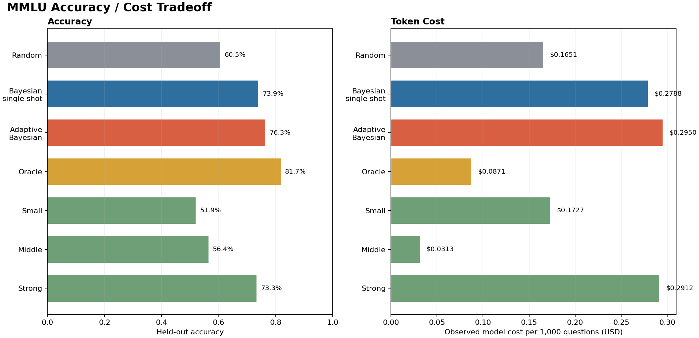

# MMLU Bayesian Orchestrator Evaluation

## Model / Context
Small multiple-choice MMLU routing demo. LangGraph executes and logs model calls for every question-model pair for offline evaluation, then Bayesian reliability models are fit only on exploration rows. A simulated adaptive policy chooses the first call by posterior expected utility, optionally makes a second call when uncertainty or invalid output justifies the cost, and adjudicates called answers by posterior reliability. The policy only sees held-out calls it has chosen.

## Diagnostics Run
- Loaded MMLU-shaped questions from either Hugging Face or the deterministic fake smoke dataset.
- Called every configured model on every selected question through a LangGraph execution graph.
- Validated missing-call model IDs against the provider model endpoint and resolved token prices from the configured versioned catalog when enabled.
- Split by question id into exploration and test partitions to avoid leakage.
- Fit separate pre-call and post-call hierarchical Bayesian reliability models over model, subject, length, cost, confidence, latency, and token features.
- Selected the first held-out call by posterior expected utility, optionally selected a second call by expected correction value, and adjudicated called answers by posterior answer scores.
- Reported proper-score, LOO ELPD, self-confidence, answer-diversity, and dependence diagnostics without using them as policy objectives.
- Compared adaptive Bayesian routing against exact random routing, single-shot Bayesian routing, always-use-model baselines, and an oracle upper bound.

## Results
- **dataset source:** hf
- **adaptive strategy:** adjudication
- **pricing catalog:** /app/pricing/token-factory-2026-06-14.yaml
- **pricing catalog version:** token-factory-2026-06-14
- **pricing catalog as of:** 2026-06-14
- **pricing currency:** USD
- **pricing snapshot:** {"Qwen/Qwen3-30B-A3B-Instruct-2507": {"input": 0.1, "output": 0.3}, "nvidia/NVIDIA-Nemotron-3-Nano-30B-A3B": {"input": 0.06, "output": 0.24}, "openai/gpt-oss-120b": {"input": 0.15, "output": 0.6}}
- **questions:** 4000
- **models:** 3
- **call matrix rows:** 12000
- **exploration questions:** 1200
- **test questions:** 2800
- **random baseline utility:** 0.57245
- **single-shot bayesian utility:** 0.68318
- **adaptive bayesian utility:** 0.70422
- **adaptive utility improvement over random:** 0.13177
- **adaptive utility improvement over single-shot bayesian:** 0.02105
- **bootstrap utility diff ci low:** 0.12162
- **bootstrap utility diff ci high:** 0.14245
- **oracle utility:** 0.79937
- **single-shot bayesian selected accuracy:** 0.73893
- **adaptive selected accuracy:** 0.76321
- **adjudicated answer accuracy:** 0.76321
- **single-shot bayesian average cost:** 0.00028
- **average calls per question:** 1.33393
- **stop after one call rate:** 0.66607
- **average cumulative cost:** 0.00029
- **myopic voi accepted call rate:** 0.33393
- **second call accepted rate:** 0.33393
- **adjudication disagreement rate:** 0.11571
- **adjudication changed answer rate:** 0.14536
- **invalid first answer call rate:** 0.09357
- **called answer diversity:** 0.94625
- **test latency p50 ms:** 1339.33
- **test latency p95 ms:** 11719.36
- **posterior brier score:** 0.13934
- **posterior log score:** 0.42715
- **posterior ece:** 0.02762
- **posterior auroc:** 0.86457
- **self-confidence delta brier:** 0.0471
- **self-confidence delta log score:** 0.12738
- **self-confidence delta auroc:** 0.08677
- **self-confidence improves correctness prediction:** yes
- **pre-call loo elpd:** -2245.28928
- **post-call loo elpd:** -1539.64402
- **dependence caution triggered:** no
- **json mode requested call rate:** 1.0
- **json mode used call rate:** 1.0
- **robustness gate utility beats random:** pass
- **robustness gate bootstrap directional:** pass
- **robustness gate policy beats best always:** pass
- **small model id:** nvidia/NVIDIA-Nemotron-3-Nano-30B-A3B
- **small input price per 1m tokens:** 0.06
- **small output price per 1m tokens:** 0.24
- **small observed prompt tokens:** 1078047
- **small observed completion tokens:** 2618726
- **small observed total cost:** 0.69317706
- **small effective output tokens per second p50:** 100.33
- **small effective output tokens per second p95:** 122.54
- **middle model id:** Qwen/Qwen3-30B-A3B-Instruct-2507
- **middle input price per 1m tokens:** 0.1
- **middle output price per 1m tokens:** 0.3
- **middle observed prompt tokens:** 1042320
- **middle observed completion tokens:** 70214
- **middle observed total cost:** 0.1252962
- **middle effective output tokens per second p50:** 39.94
- **middle effective output tokens per second p95:** 81.07
- **strong model id:** openai/gpt-oss-120b
- **strong input price per 1m tokens:** 0.15
- **strong output price per 1m tokens:** 0.6
- **strong observed prompt tokens:** 1232818
- **strong observed completion tokens:** 1649429
- **strong observed total cost:** 1.1745801
- **strong effective output tokens per second p50:** 277.99
- **strong effective output tokens per second p95:** 398.13
- **observed call matrix total cost:** 1.99305336
- **random observed average cost usd:** 0.00016511
- **single_shot_bayesian observed average cost usd:** 0.00027876
- **adaptive_bayesian observed average cost usd:** 0.00029496
- **oracle observed average cost usd:** 8.706e-05
- **always_small observed average cost usd:** 0.00017275
- **always_middle observed average cost usd:** 3.134e-05
- **always_strong observed average cost usd:** 0.00029124
- **always_small utility:** 0.48474
- **always_middle utility:** 0.55766
- **always_strong utility:** 0.67497

## Plots
### MMLU accuracy and observed USD cost comparison

## Warnings
- The adaptive policy is a cost-sensitive myopic heuristic, not full BED-LLM expected information gain.

## Recommended Next Step
Use the Bayesian orchestrator as a candidate policy for a larger live Token Factory run. This run improved held-out utility over random routing by 0.1318 and cleared the utility gates.

## Reproducibility Metadata
- **workflow_version:** 0.1.0
- **created_at_utc:** 2026-06-15T17:35:28.242320+00:00
- **config_path:** /app/examples/mmlu-bayesian-orchestrator/mmlu-pro-final.yaml
- **seed:** 48219
- **python:** 3.12.12
- **platform:** Linux-6.11.0-1016-nvidia-x86_64-with-glibc2.36
- **pricing_snapshot:** {"as_of": "2026-06-14", "catalog_path": "/app/pricing/token-factory-2026-06-14.yaml", "currency": "USD", "prices_per_1m": {"Qwen/Qwen3-30B-A3B-Instruct-2507": {"input": 0.1, "output": 0.3}, "nvidia/NVIDIA-Nemotron-3-Nano-30B-A3B": {"input": 0.06, "output": 0.24}, "openai/gpt-oss-120b": {"input": 0.15, "output": 0.6}}, "version": "token-factory-2026-06-14"}
